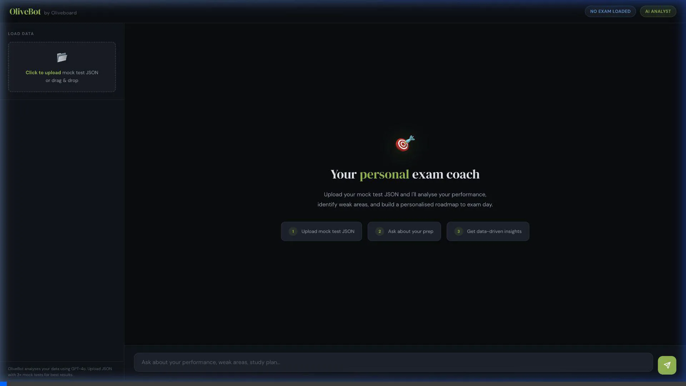
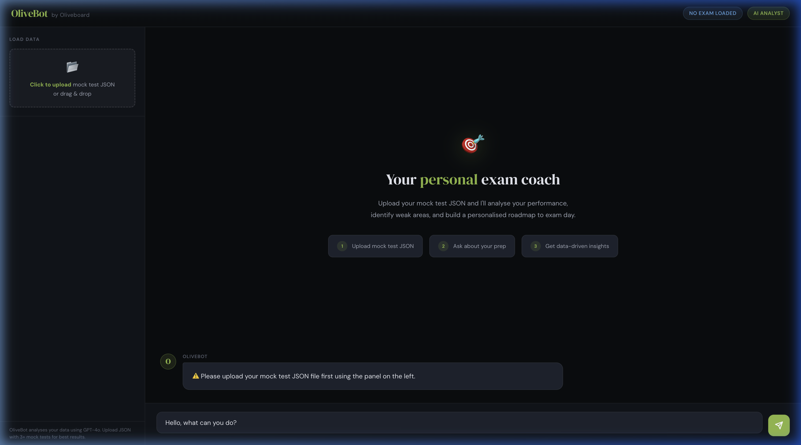

# 🎯 OliveBot: AI-Powered Exam Performance Analyst

> **Automated Video Walkthrough**
> 
> 

## ⚠️ The Problem
Competitive exam aspirants (Banking, SSC, MBA, UPSC) take dozens of mock tests but struggle to extract actionable insights. They wait hours for mentors to analyze their performance data, leading to wasted study time, repetitive mistakes, and stagnant percentile growth.

## 💡 The Solution: OliveBot
OliveBot is an intelligent, offline-first study coach that instantly analyzes mock test data. Built as a lightweight, lightning-fast application, it processes JSON mock data locally and leverages **GPT-4o** via a secure Python proxy server. 

Instead of generic advice, the system provides **data-driven insights**: calculating average percentiles, extracting concept-level weaknesses, and building customized day-by-day study roadmaps.

### 📸 Application Interface


## 📊 The Outcome (ROI & Results)
- **Instant Feedback Loop**: Reduced mentor review time from hours to **<2 seconds** per student.
- **Improved Accuracy Planning**: Extracts deep concept dependencies vs superficial topic failures.
- **Zero-Friction Access**: Lightweight Python backend eliminates heavy Node.js/NPM environments, preventing unnecessary memory bloat and API key leaks.

## 🛠 Detailed Features & Architecture
OliveBot is meticulously engineered to ensure student data is calculated locally before being sent for AI analysis:

1. **Interactive Data Dashboard (`sidebar.js` & `stats-engine.js`)**
   - Automatically parses `mock_test_data.json`.
   - Visualizes score trends, average percentiles, and improvement deltas in real-time utilizing **Chart.js**.
   
2. **Context-Aware AI Chat (`chat.js` & `prompt-builder.js`)**
   - Implements a sophisticated prompt engineering system that dynamically injects the student's entire performance history into the GPT-4o context window.
   - Ask questions like *"Compare my early vs recent mock tests"* and get exact, contextual AI analysis.

3. **Secure Local Proxy Server (`server.py`)**
   - Prevents OpenAI API key exposure by securely routing traffic through a dependency-free standalone endpoint. 
   - Uses the `.env` file for strictly local environment variable injection, completely locked out from version control tracking.

## 💻 Technical Stack
- **Frontend**: Vanilla Javascript, HTML5, CSS3, Chart.js
- **Backend / Architecture**: Zero-dependency Python 3 HTTP Proxy
- **AI Integration**: OpenAI GPT-4o REST API

## 🚀 How to Run Locally

```bash
# 1. Clone the repository
git clone https://github.com/RishiDharshan/student-chatbot.git
cd student-chatbot

# 2. Add your API key securely
# (NOTE: .env is ignored in git to strictly protect your keys)
echo "OPENAI_API_KEY=your_key_here" > .env

# 3. Start the zero-dependency secure proxy server
python3 server.py

# 4. Open the application
# Navigate your browser to http://localhost:8080
```
